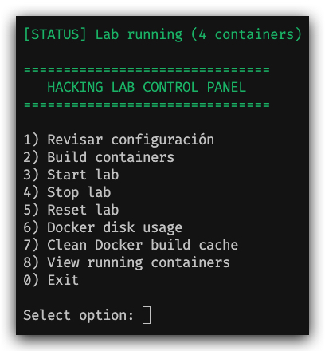

# El nacimiento de un lab

A mitad del año anterior comence a explotar maquinas en hackthebox, pero mi interes comenzo a bajar porque tenia que levantar la maquina virtual en utm, esperar que iniciara, iniciar la vpn y esperar que conectara, ademas nunca logre configurar bien los directorios compartidos y no podia rescatar la información que iba sacando a mi host principal de forma óptima aparte de que la maquina ocupaba un monton de espacio en mi disco duro. cerca de 20 o 30 gigas. Todo eso me hizo cuestionar y buscar un flujo de trabajo alternativo. Ademas tambien queria hacer cfts offline de dockerlabs y no podia por falta de potencia en la vm.

# Viendo alternativas

De comienzo pense en armar una red entre la maquina virtual, gns3 y docker. No consegui que se vieran XD asi que fue descargatada. Segunda opcion armar un lab con docker, al principio tenia dudas con esto por temas de la interfaz grafica, pero luego investigando con ChatGPT, descubrimos que se podia asi que finalmente la infraestructura quedo de esta forma.

<p align="center">
  
</p>

# Describiendo cada contenedor.

La infraestructura está compuesta por varios contenedores que cumplen roles específicos dentro del laboratorio.

## 🧑‍💻 Attacker

Es el contenedor principal desde donde realizo todas las pruebas.

Aquí es donde ejecuto herramientas como:

- nmap  
- scripts personalizados  
- pruebas de enumeración  

Este contenedor actúa como mi máquina atacante dentro de la red.

---

## 💣 Metasploit

Contenedor dedicado al uso del framework Metasploit.

Lo separé del contenedor principal para:

- mantener un entorno limpio  
- trabajar exploits sin contaminar el entorno base  

Además permite ejecutar ataques más complejos sin afectar otras herramientas.

---

## 🎯 Máquina vulnerable

Es el objetivo del laboratorio.

Estas máquinas se cargan dinámicamente desde DockerLabs y representan distintos escenarios vulnerables para practicar.

Cada máquina puede tener:

- servicios abiertos  
- configuraciones débiles  
- vulnerabilidades explotables  

---

## 🖥️ GUI

Este contenedor entrega una interfaz gráfica accesible desde el navegador mediante noVNC.

Lo utilizo cuando necesito:

- visualizar herramientas gráficas  
- tener un entorno más cómodo  
- analizar información de forma visual  

---

## 📁 Workspace

Es un volumen compartido entre todos los contenedores.

Aquí guardo:

- scripts  
- resultados  
- notas  
- evidencia  

Esto permite que toda la información generada dentro del lab no se pierda y sea accesible desde cualquier contenedor.

---

## 🌐 Red interna

Todos los contenedores están conectados a una red interna de Docker:

172.30.0.0/24

Esto permite que se comuniquen entre sí como si estuvieran en una red local real, sin exponer servicios al exterior.


# Como funciona esto?

Esto funciona a través de un menu de despliegue interactivo alojado en la raiz del proyecto, porque a través de un menú? Porque si tengo que escribir un comando mas de tres veces lo automatizo. 

## Paso previo

Antes de comenzar, debemos cargar la máquina que vamos a atacar dentro del sistema, esta podemos descargarla desde [DockerLabs](https://dockerlabs.es/).

Una vez descargado la imagen debemos descomprimirla, al hacerlo se veran dos archivos, un bash que al ejecutarlo carga la maquina en si, pero no lo usaremos, pero no lo usaremos (lo cargaremos de una forma mas limpia y que quede alineado con nuestro entorno) y la imagen en archivo tar (No lo descomprimas dejalo).

El siguiente paso es abrir una terminal en el directorio donde se encuentra la imagen y ejecutar el siguiente comando (reemplazando artefacto por el nombre de la máquina):

```bash
docker load -i artefacto.tar
```

Esto cargará la imagen dentro de docker si hacemos:

```bash
docker image ls
```

Deberiamos obtener una salida similar a esta:

```text
REPOSITORY TAG       IMAGE ID       CREATED        SIZE
artefacto  latest    6fc6352f3667   2 years ago    416MB
```
## Agregar el artefacto a nuestro entorno.

Debes agregar una entrada similar a la siguiente en tu archivo `docker-compose.yml`, antes de la sección `networks`:

```yml
 artefacto:
    image: artefacto:latest
    container_name: artefacto
    tty: true
    stdin_open: true
    networks:
      - labnet
```
Con esto resuelto, ya podemos utilizar nuestro menú para desplegar el entorno.

> Recuerda este paso previo se debe hacer cada vez que queremos hacer una nueva máquina.

## Flujo.

- Primero damos permiso de ejecución al archivo

```bash
chmod +x ./menu.sh
```
- Segundo iniciamos nuestro

```bash
./menu.sh
```
veremos la siguiente pantalla:

<p align="center">
  
</p>

Pero si presionas la opcion 3, hace el build de las imagenes y levanta los contenedores directamente.
